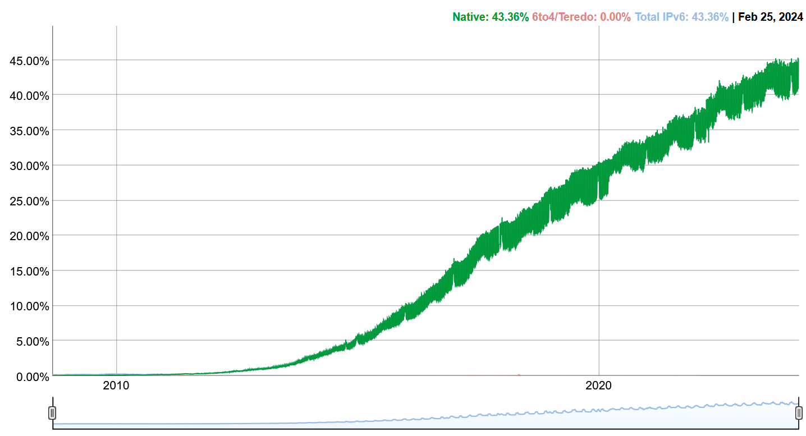
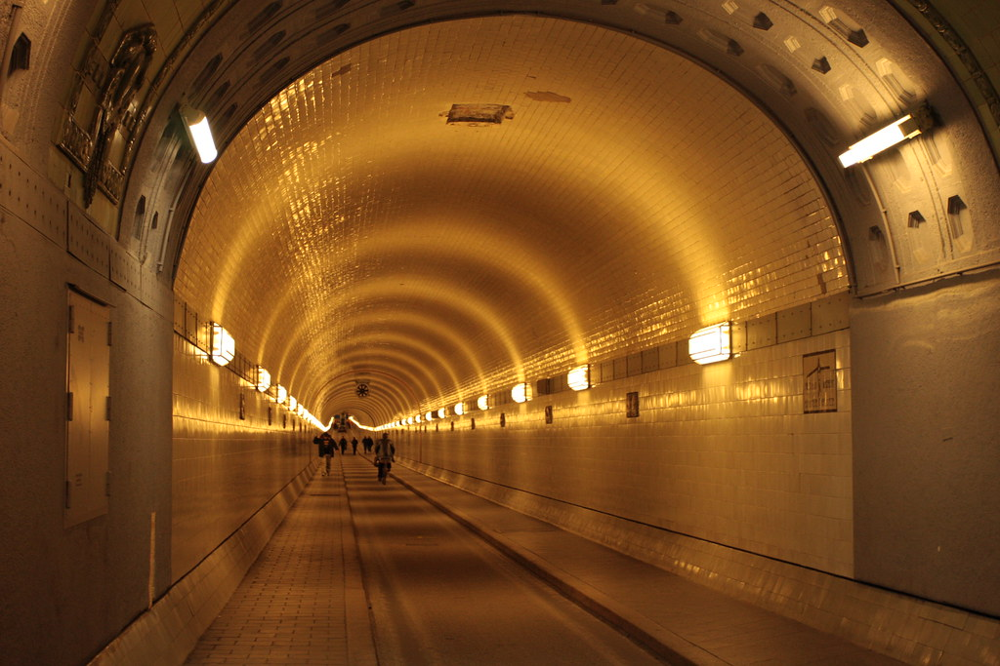

*Credits: Google Stats*[^0]

According to [Google Stats]( https://www.google.de/ipv6/statistics.html) around 43% of the internet traffic to Google is using IPv6. We have run out of IPv4 for a good 13 years now[^1]. 
So why are we still using IPv4? The answer is simple: It's hard to change.

## IPv6

IPv4 is extremely simple to understand, nearly everyone knows what their local routers IP is, and when somebody posts your IP online and it starts with `192.168` you know it's a local IP and you just encountered a script kiddie.

IPv6 is a bit more complicated, just the fact that it is written in hexadecimal makes it harder to understand. But it's not just the notation, it's also the fact that it's a lot more complex than IPv4.

Why go through the hassle of setting up IPv6 when you can just use IPv4? 

Well, the answer is simple: We are running out of IPv4 addresses. And if you are a small company or a private person, you might not even get an IPv4 address from your ISP.

The reactions to IPv4 depletion are as mixed as you can imagine. 

Some countries, with India being the most prominent example, have started to use IPv6 as their primary protocol. 

Others, like Germany, have started to use a technology called DS-Lite that allows them to use IPv6 as their primary protocol and IPv4 as a fallback. 
In that scenario, the ISP provides you with an IPv6 address and a shared public IPv4 address with other customers.

And then there are countries such as the US or Netherlands that are still using IPv4 as their primary protocol and have barely begun to use IPv6. 

As a small funny sidenote about the Google Stats that nearly caused me to spread misinformation, China has a 5% IPv6 usage rate according to it, until you remember that Google is blocked in China and that traffic is most likely from VPNs which rarely ever use IPv6.
According to a presentation by China Telecom, they have a 44% wired IPv6 adoption and a 80% mobile user adoption and are aiming for 100% by 2030.

There are also lunatics that would rather change the IPv4 protocol to allow for more addresses than to switch to IPv6, but that whole thing is so absurd and bonkers that I won't even go into it.[^5]

## Germany

")

Get it, it's a DS Lite. Pinnacle of comedy right here.

Since I'm from Germany, I can tell you a bit about the situation here. My ISP has been using DS-Lite for a few years now, 
at first it was quite easy to get a public IPv4 address but throughout the years it has become harder and harder to get one.

Initially you could simply call them and ask for a public IPv4 address. 
Later you could make up a fake story about your company VPN not working, being as tech-illiterate as possible, and they would give you a public IPv4 address or buy an additional IPv4 package.

However, now they simply tell you that you can either buy a business line or (sometimes? Couldn't confirm this) get a public IPv4 address for a monthly fee, depending on whoever is on the phone.

At first this seems fine, esp. with the shared IPv4 address *most* things work. But sometimes you run into really frustrating issues, 
for example, FoundryVTT doesn't seem to work well with DS-Lite, and you can't port forward to your local machine which means you either buy *way* too expensive FoundryVTT servers or host it on a VPS, which is also quite a lot of setup, esp. for people who are not tech-savvy.

Ironically enough, all these issues a bit of a deja-vu for me. "Back in the days" every single person I knew had Hamachi[^4] installed because games usually didn't have proper private online servers or port forwarding was too complicated for most people.

If you wanted to play Minecraft, Garry's Mod, or any other game with your friends, you would usually have that one friend in your group that would always be the person that rented the game server (usually me 😅) or you had to use Hamachi[^4].

Nowadays Hamachi[^4] is extremely business-oriented and not really usable for private customers anymore, but the same issues are resurfacing, just in a different form.

## Tunnels

*Image by Henry Mühlpfordt[^6]*

If you want to host something at home, you could still use hamachi-like solutions such as ZeroTier[^3], which do work quite marvelously, but that really isn't an option for everyone, 
and if you want to host something like a website, you can't really use that, the internet kinda moved past smaller networks like that and I don't think I'll convince users to install ZeroTier[^3] to visit my website 😆.

You could also use IPv6 but considering the aforementioned issues, that's not really an option for everyone either, if I want my American or Dutch friends to visit my website, there is a quite high chance that they won't be able to access it.

So what can you do? ~~Well, it's time for my disclosure that this isn't meant to glorify Cloudflare, but they do have a really nice solution for this problem (Tunnels & Access) which I can't really find any good alternative for, and it's free.~~

**Edit:** Thanks to [Emily](https://github.com/jakibaki) I have been made aware about the fact that [Tailscale](https://tailscale.com/) also provides a simlilar service, _also for free_, including a public subdomain, even when you don't own your own domain (Though you can still use a custom domain if you want to).
It also provides very similar features to ZeroTier[^3] so you get the best of both worlds, including the ability to mix and match between public and vpn-only services.

Tailscale allows you to tunnel your traffic through their network **without** exposing your IP address or even having a public IPv4 address.

It's so extremely simple to set up that I'm surprised that more people don't use it, I have struggled to find a good solution for this problem that isn't "rent a Ipv4 from us and proxy your traffic through us" and there it is, completely free.

You can even use their SSO identity service to restrict access to your tunnel to only certain people, which is quite nice if you want to host something private. 

For example, you can expose Portainer to the internet without having to worry that much. 
That probably made Network Admins shiver in fear but rest assured, Tailscale allows you to greatly secure the entire tunnel (OAuth2 + Passkey + Security Key). 
(Though you should still secure your services, the more layers of security the better).

Either way, if you're in a similar situation as me, I can highly recommend this solution, it's free, it's easy to set up, and it's secure.

That's it. I'll now go touch some grass. 🌱

I also still need to talk about the rewrite of my website, but that's a topic for another time (never), I swear it's really sick though.

[^0]: [IPv6 usage stats](https://www.google.com/intl/en/ipv6/statistics.html)
[^1]: [IPv4 TL depletion](https://www.nro.net/ipv4-free-pool-depleted)
[^2]: [China Telecom Slides](https://datatracker.ietf.org/meeting/interim-2020-v6ops-01/materials/slides-interim-2020-v6ops-01-sessa-ipv6-development-and-current-sta-tus-of-china-telecomchina-00.pdf)
[^3]: [ZeroTier](https://www.zerotier.com/)	
[^4]: [Hamachi](https://en.wikipedia.org/wiki/LogMeIn_Hamachi)
[^5]: [IPv4 extension proposal](https://www.theregister.com/2024/02/09/240_4_ipv4_block_activism/)
[^6]: [Elbtunnel by Henry Mühlpfordt](https://www.flickr.com/photos/wimox/5344581240)