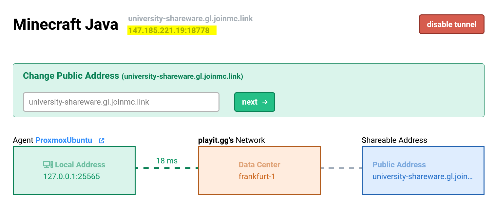
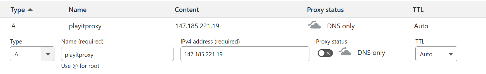
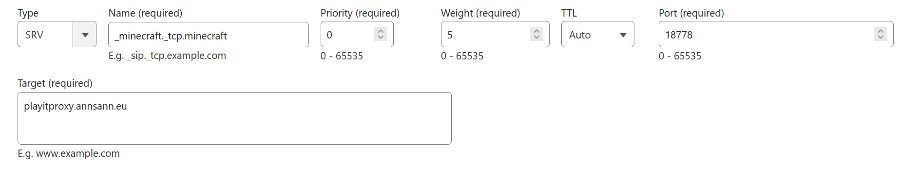
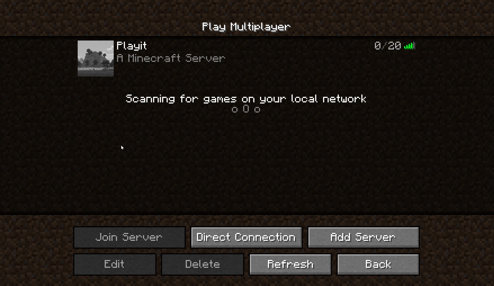

This is a bonus post related to the [previous post (How to host a Minecraft server, sustainably, locally, and securely)](../sustainable_minecraft/), which was a sequel to [IPv6, Germany and Tunnels](../ipv6_germany_tunnels/).

A big shoutout to [Noah](https://github.com/noahc3) for telling me about this!

In the previous post I talked about playit and the fact that you couldn't set a custom domain for your server unless you pay for it. But there is a way to get a custom domain for free, 
on nearly every single server hoster, and it's called SRV records, which still feels like black magic to me.

## What is an SRV record?

An SRV record is a DNS record that specifies the hostname and port number of servers for specified services. It is defined in [RFC 2782](https://datatracker.ietf.org/doc/html/rfc2782) if somebody is nerdy enough to read through that.

This allows you to have Minecraft running on any port and ip address you want, and still connect to it using a custom domain without having to specify the port in the server address.

Even though this sounds amazing, esp. for websites, the huge downside is that not every client supports SRV records, including web browsers. 

Looking this up I expected that being due to some security reasons, but it seems like it's just because [barely anybody at the IETF cared about SRV](https://stackoverflow.com/questions/9063378/why-do-browsers-not-use-srv-records).

However, Minecraft does support SRV records, and that's what we are going to use it for.

## How to set up an SRV record

Here is how to do it based on PlayIt, but it should be similar for other tunnel services or any other server hoster that doesn't allow you to set a custom domain for free (or at all).

1. Get the IP and port of the Minecraft server. In the case of PlayIt they mention it on their page.

2. Create a proxy A record that points to the IP of the server. This is necessary because you can't create an SRV record pointing to another SRV record.

3. Point the SRV record to the proxy A record. 
  - The format of the SRV record is `_minecraft._tcp.NAME` as the name, where NAME is whatever name you'd like to connect to
    - For example, `_minecraft._tcp.peter` would allow me to connect to the server using `peter.yourdomain.com`
  - the priority and weight can be set randomly (I set them to 0, 5)
  - the port is the port of the server (e.g. 18778) *not* the standard Minecraft port (25565)

4. Congratulations! You can now connect to your server using the custom domain.

## Conclusion

SRV is black magic. 

That's it.

Again, big shoutout to [Noah](https://github.com/noahc3) for telling me about this!

Okay, goodbye. I've reached my quoata for this year, see you next year when I write another blog post.