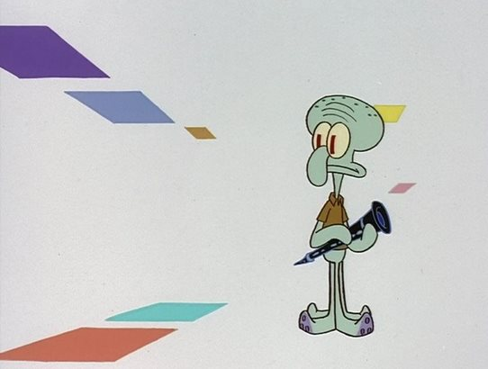
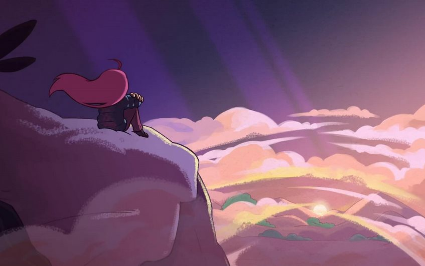

*EDIT:* I once again changed the entire blog to be a completely static site using Astro. The things mentioned here still apply though for the most part.

So uh, hi I guess, I’m AnnsAnn. Over the last month or so I've decided that instead of setting up a static blog using Hugo etc. it'd be a lot more fun to create this site from scratch. In the end I'm not sure whether it was the right decision to create this site but here we are 😅

One of the things that has recently been fascinating me is neocities. It’s a spiritual successor to geocities that allows people to host their own custom sites in a more traditional kind of way. The concept of “fully” owning my own blog has always been important to me, however, aside from the glaring issues such as the theme being an absolutely disgusting thrown together hack that I created 6 years ago without the most basic understanding of the web the thing that finally made me decide to switch is that I simply wanted to create a new site.

Sure it's a lot more work and risk to maintain your own site but I think in some scenarios going with what you already have, even if you know that the new site you could have is much greater and fulfilling, just because you are scared of loosing the stability that you had with your former site, isn't the right choice, even if it's a hard choice to make.

In our modern world we strive for perfection, a site needs to be responsive, accessible and written by a master at its field, but I don’t really think that that is the right path to take. A personal site should be the glorification of one’s creativity, visualizing what subjective design opinions the author enjoys. That is exactly what most neocities sites are, inaccessible weird sites.

This doesn’t really apply to this site given that I have taken great care of making this site properly scale with most resolutions (Though lets ignore how empty this site feels on 4K) I do think that these sites aren’t anything more than a kind of reflection of yourself where you write random thoughts down, not because you expect people to actually read them but just because it sometimes feels good to shout into the empty void that is the world wide web.

I’ve intentionally tried my best to make this site as “inaccessible” to search machines as possible in hopes of not being indexed, simply because I don’t think I want anything more from this site than to have a room to write down my thoughts about stuff that I enjoy.

I initially wanted to talk about the usual “how this site is made” crap but I’ll probably save that for a later date just because I don’t really think it’s too important, but I do want to highlight some cool things that I included 😊

Most pages on this site are written using a specialized form of markdown called mdx which allows me to easily script elements into my text ala JSX/TSX which I personally think is really freaking cool. Hugo and other static site generators offer similar features too, but it just hits different when you can dynamically interact with all other elements on your site.

One of the cooler examples of this is something I added quite late, the “Music for this Page” box right next to this text. I love associating things I release with music and have been doing it for well over 6 years by now, so I thought it’d be quite fitting to also have that feature on my own site. **------\>**

**\<------** Another cool thing about this site is that you can seamlessly switch between themes by clicking on the “Change Theme” button on the right sidebar (Or top if you’re on mobile). I really like it when sites have a degree of customization to make each person that reads this blog have a “unique” experience so feel free to pick a theme that you like, it should also, as long as you don’t clear your local storage for this site, remain chosen.

Anyways, I think this is it for the first blog post on this new site of mine. I know that it doesn’t seem like much, but I just wanted to get this site finally out there for everyone to see. 