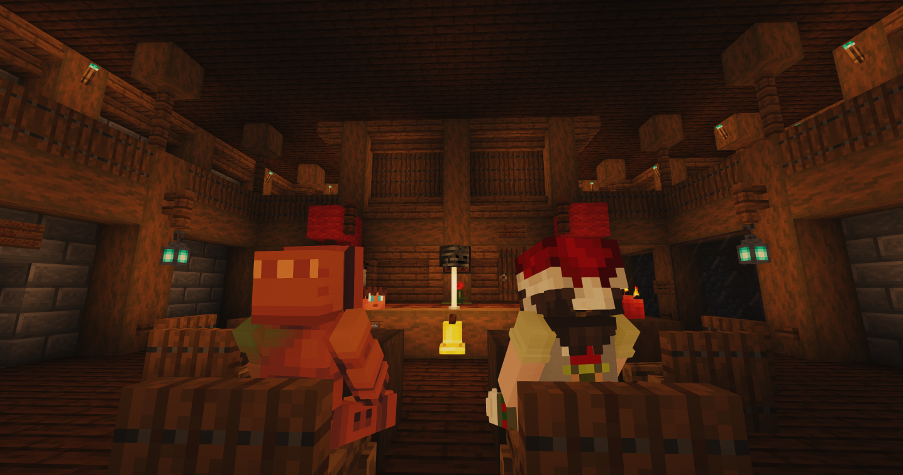
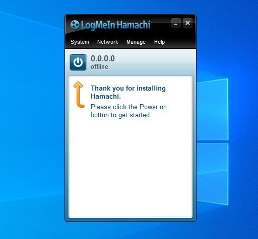
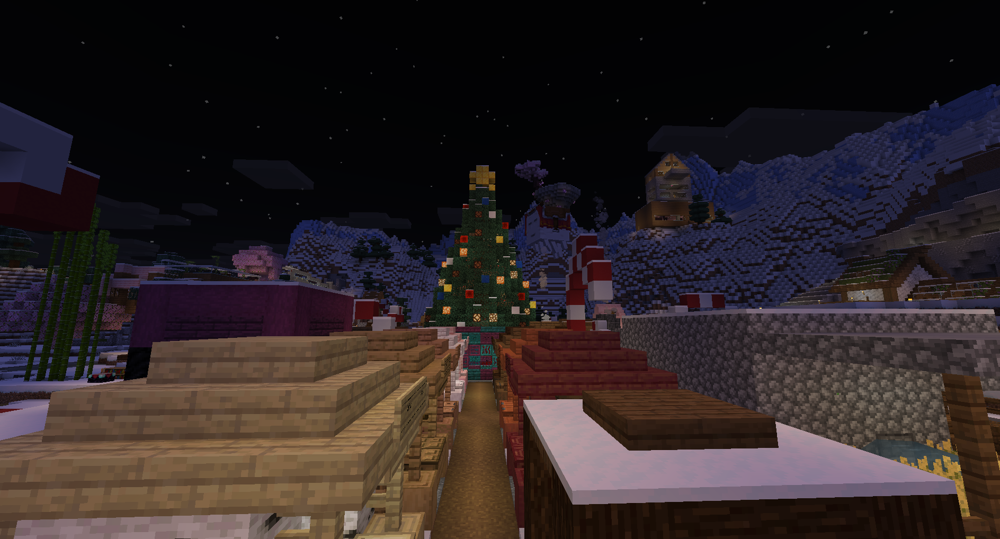

This is technically a sequel to [Minecraft SRV Record Magic](/blog/minecraft_use_custom_domains/),
which is a bonus to [How to host a Minecraft server, sustainably, locally, and securely](/blog/sustainable_minecraft/),
which is a sequel to [IPv6, Germany and Tunnels](/blog/ipv6_germany_tunnels/). ~~I swear this is the last one.~~



As with every year for the last decade, some friends and I are having the yearly Minecraft winter project, 
where we set up a Minecraft server for a few weeks and build some cool stuff together.

This time around
we wanted to include Minecraft Bedrock players on the server, which proved to be a bit tricky
with my current setup.

## A timeline

Lets quickly talk about a rough timeline of how we played Minecraft in the past, to better understand why.
If you are bored by this, it would be truly rude to -\> skip to [The Reverse Proxy Part](/blog/simple_reverse_proxy/#reverse-proxy) \<-.

### The Beginnings

Over the years the way I have hosted this server has changed drastically.
It all started with a simple hamachi setup. 
Thanks to have fundementally broken IPv4 is on the modern web, we didn't understand NAT,
nor how to forward ports, it was also complicated and confusing.



Back then nearly everyone had Hamachi installed, from Minecraft to Terraria, if you were playing
a game back then, you were pretty much bound to use hamachi.

Later, after finding out how paysafecards work, we rented small servers, think of Nitrado [^3] or other
insanely expensive Minecraft server hosts. They honestly served their function well, as with most
Minecraft projects it would usually die after the holy _2 Week Minecraft Phase_, thus we usually
only paid a few bucks. Nonetheless, a few bucks can be a gigantic amount of money, esp. for children.

### Aternos

")

At some point Aternos [^1] servers were becoming fairly usable. Aternos provided free servers financed
through website ad-revenue. Given that a simple VPS can be fairly affordable, that would seem like a fairly
niche business model, however, esp. for children this provides one of the very few safe and trusted ways to
easily play Minecraft together.

Nowadays Aternos even provides a paid service called Exaroton [^2], which basically just provides a supercharged Aternos
experience to you. However, one notable downside that Aternos had was the fact that A. you had to wait in a queue to start
your server and B. somebody had to be on the server for it to keep running. Honestly considering that this service is totally
free those stipulations were quite fair, however, as we became older, esp. stipulation B started become annoying,
in the teens sleep schedules and free time started to drift more and more apart, until we finally made the switch to actual
servers again.

### Minecraft VPS'

While money was still a problem, considering we were still children, we started finally buying servers again, this time from cheaper Minecraft VPS' hosts.
Nitrado [^3] usually offered a far better UX, however, it's not like it's rocket science to start a Minecraft server.

One of the longest lasting providers since we moved to using VPS' is probably ExtraVM [^4]. At first their UI was a bit rough, but as a kid your
most important decision factor was the price and esp. nowadays I feel like their prices were always super fair.

However, as I grew older and actually started understand what the heck a NAT even is, hosting stuff locally started becoming both feasible
and also interesting, mostly as a challenge, esp. considering that every blog post over the last (nearly) 2 years was about the pitfalls
and annoyances that come from it.

### Hosting Locally

Most of it is honestly explored in fairly great length in both [IPv6, Germany & Tunnels](/blog/ipv6_germany_tunnels/) and esp. [Hosting a Minecraft server sustainably](/blog/sustainable_minecraft/).

The TLDR of that is that Germany provides a unique challenge for self-hosting nowadays. My ISP does have IPv6 support, which is great, but a lot of my friends don't have IPv6 support. But I also can't really use
IPv4 because NAT is unforgiving and even more importantly, because I quite literally can't even really open ports anymore. My IPv4 is shared with countless other customers and also changes every X hours.

")

My past solution to this was to simply use a combination of Playit [^6] (See [The Playit section](/blog/sustainable_minecraft/#2-playit)) for game TCP/UDP traffic,
esp. for Minecraft, and Cloudflare Tunnels for web stuff.

This still works, *for the most part*. In the most recent winter project, we wanted to include Minecraft Bedrock players on the server.

Generally, Playit [^6] does support this usecase, with the tradeoffs mentioned within that blog article.
However, this year, for a reason I'm still not properly sure about, Playit kept breaking the port.
First users could connect but then after some time both the Bedrock and Voice Chat ports would completely block up, not responding to any requests anymore.

## Reverse Proxy

")

A reverse proxy is basically a server that sits in front of your actual server and forwards requests to it, thus acting as an intermediary.

I honestly don't feel like using a free and "hacky" solution for so long was the wrong way to approach this but with this bug happening at the beginning of the only time my server ever gets traffic (Alias the big Minecraft project), settling with some weird solution to this problem felt wrong. What both Cloudflare and Playit offer are effectively limited and very specific solutions to Reverse Proxies.
Both route local data through a tunnel, thus, the logical next step was to finally do it myself to get rid of the limitations and take control of the stack.

### Finding the right server for the job

There are three important factors to consider here:

1. The server should be in Germany / EU. Both for digital sovereignty and because anything else would cause lag on game servers (which is arguably the most important part of this entire setup).
2. The server should be really really cheap. I don't need an actual beefy VPS, I need an exit node to my cheap local homeserver with fairly minimal web traffic.
3. The server needs to have a fully dedicated IPv4. I'm not about to settle with another hack, if I commit to it I want to do it right.

In the end the boiled down to a few options, till I finally settled on IONOS 1€/month VPS.
It doesn't really offer much, at 1 vCore, 1 GB RAM and 10 GB NVMe storage, but also like, I don't need much, as long as it can run a reverse proxy I am happy.

### Setting up the Server

The first step was completely deleting the standard firewall configuration IONOS ships with.
Depending on your willingness (and sanity) you could most likely do the entire setup within their web interface,
however, since, for some absurd reason, it doesn't even allow copy-pasting, I decided that setting up SSH access would be easier
... until I remembered that I already set up a tailscale network that connects my home server, a few friends and my own computer.

I [mentioned Tailscale in another blog post before](/blog/ipv6_germany_tunnels/#tunnels).
It's a very simple way to setup a VPN between multiple devices, including routing, security, and easy access.
It's mostly targeted towards businesses, however, their free plan is more than enough for personal use.
The main reason to use it here is that it allows me to easily SSH into the server without exposing the port, nor having to deal with setting up SSH keys,
e.g. if something breaks I can easily check from any computer or phone as long as I have my security key, password and Tailscale access.

### Rathole

")

For the actual reverse proxy I used Rathole [^7], a fairly new reverse proxy/tunneling solution written in Rust.
It's fairly similar to ngrok, frp and other well established solutions, though with a higher bandwidth and smaller memory footprint, which is ideal for this usecase. [^7]

All that is required is to install Rathole on both the server and the client (my home server), set up a simple systemd service on both sides and pass a configuration file to both sides.

")

#### Client (Home Server)

On the client (my home server) we need to simply specify the server address, the token (which must match the server side) and the local address of the Minecraft server.
The client will then connect to the server (reverse proxy IONOS VPS) and forward all traffic to the local Minecraft server.

```toml
# client.toml
[client]
remote_addr = "myserver.com:2333" # The address of the server. The port must be the same with the port in `server.bind_addr`

[client.services.minecraft]
type = "tcp"
token = "use_a_secret_that_only_you_know" # Must be the same with the server to pass the validation
local_addr = "127.0.0.1:25565" # The address of the service that needs to be forwarded

[server.services.bedrock]
type = "udp"
token = "use_a_secret_that_only_you_know" # Token that is used to authenticate the client for the service.
bind_addr = "0.0.0.0:19332" # The port that the service is exposed on, on the server side
```

#### Server (Reverse Proxy VPS)

The setup is fairly similar on the server side, we need to specify the bind address (the address that the server listens on) and the service configuration.
Do remember to use a non-trivial token though (alias simply ask your password manager for a huge random password).

```toml
# server.toml
[server]
bind_addr = "0.0.0.0:2333" # `2333` specifies the port that rathole listens for clients

[server.services.minecraft]
type = "tcp"
token = "use_a_secret_that_only_you_know" # Token that is used to authenticate the client for the service.
bind_addr = "0.0.0.0:25565" # The port that the service is exposed on, on the server side

[server.services.bedrock]
type = "udp"
token = "use_a_secret_that_only_you_know" # Token that is used to authenticate the client for the service.
bind_addr = "0.0.0.0:19332" # The port that the service is exposed on, on the server side
```

Also, remember to change the IONOS firewall to allow traffic to the specific port (25565 TCP for Java Edition, 19332 UDP for Bedrock Edition).

## The Result



This setup has been running for the last month-ish, in that time I did not touch the VPS a single time (other than to add another port once).
So far, compared to Playit, there hasn't been a single instance where the port broke and other than some issues caused by the infamously broken Bedrock Edition,
the server has been running flawlessly.

In the end Playit is still a great service, however, considering that the entire setup took (literal) minutes, cost 1€/month and provides a far more reliable experience, I'll probably stick with this setup for the foreseeable future.

Anyways, that's it. Now I can claim that I have written a blog post every single year and never missed a year since starting the blog :)

[^1]: https://aternos.org/:en/
[^2]: https://exaroton.com/:en/
[^3]: https://server.nitrado.net/en-US
[^4]: https://extravm.com/
[^5]: https://modrinth.com/plugin/geyser
[^6]: https://playit.gg/
[^7]: https://github.com/rathole-org/rathole/
