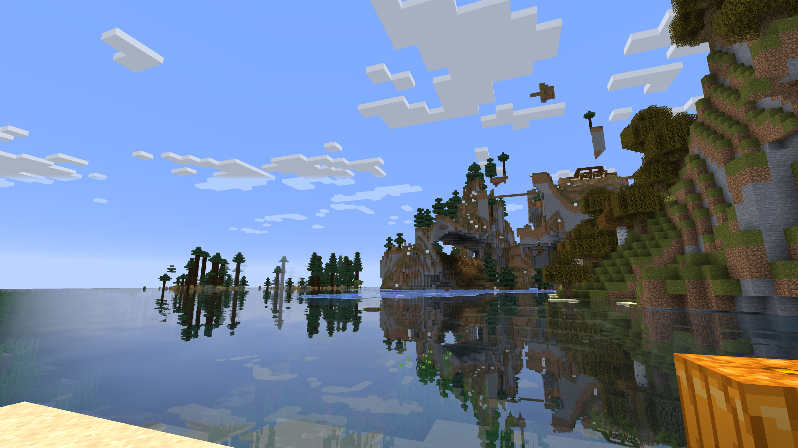
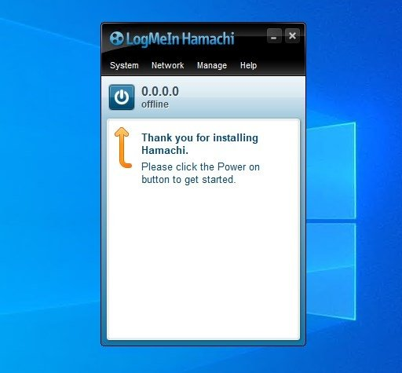

This is a follow-up to my previous article [IPv6, Germany and Tunnels](../ipv6_germany_tunnels/) where I discussed the state of IPv6 and how to set up a tunnel to publicly host services even without having a public IPv4.

In this article, I will show you how to use quite similar techniques to host a Minecraft server, sustainably, locally, and securely. 

I'd advise you to read the previous article first, as I will not go into detail about the basics of IPv6 and tunneling.

## The problem

I have been hosting Minecraft servers for my friends for quite some time now, actually, by now it's been over 10 years of hosting Minecraft servers every now and then.

Initially, I hosted the servers on my own computer using Hamachi to create a small VPN network. This worked quite well, esp. since we were still children back then and renting a server would have been too expensive.

Later, renting a server started to make more sense. However, it also normally gave our projects a time limit, as we would only rent the server for a month or so.

This was fine for most projects since Minecraft projects tend to only last a few weeks. However, it was always a bit sad to see the server go offline, and the world we built together disappear.

Having a server at home would solve this problem, but it would also introduce a new one:

Minecraft servers are quite resource-intensive even when running the most optimized version. 
That's not as much of a problem in countries such as the US where energy costs are often quite neglectable, however, 
in Germany, esp. in the North that produces a lot of electricity[^0], energy costs are extremely high. Ranging from 30 to 40 euro cents per kWh ($0.33-$0.44 USD/kWh).

This makes hosting a server at home quite expensive, esp. since even when idle, Minecraft servers continue to consume a lot of CPU and RAM. 

Also, as mentioned in the [previous post](../ipv6_germany_tunnels/) I have DS-Lite, which makes hosting a server at home quite difficult.

## The solution

There are three parts to the solution that combined make it quite feasible to host a Minecraft server at home:

### 1. Deep Sleep Server Wrapper

The most useful part is [MC Sleeping Server Starter](https://github.com/vincss/mcsleepingserverstarter) by [Vincss](https://github.com/vincss). 
This little node server wraps around the Minecraft server and waits for a connection request by a whitelisted user to cold start the server.

This does result in a small wait time when connecting to the server, but it also **drastically** reduces the energy consumption of the server.

### 2. PlayIt

[PlayIt](https://playit.gg/) is a service similar to Tailscale or Cloudflare Tunnel (See previous post: [IPv6, Germany and Tunnels](../ipv6_germany_tunnels/)).

However, PlayIt is specifically designed for game servers (TCP & UDP traffic) and offers a free tier that is quite generous, ~though using a custom domain is only available in the paid tier~.

**EDIT: I've been informed about [a really cool way to use a custom domain with nearly every server/tunnel provider. You can check it out HERE](../minecraft_use_custom_domains/).**

Technically this is also doable using Tailscale but requires far more setup and is not as plug and play for game servers as PlayIt is. 

After less than a minute of setup, I had my server running and publicly accessible.

[^0]: [Netzentgelte](https://www.ndr.de/nachrichten/info/Netzentgelte-sorgen-im-Norden-fuer-hoehere-Stromrechnungen,strompreis200.html)

### 3. Empty Server Stopper 

The last part isn't as crazy as the other two, but it provides the essential functionality to stop the server when no one is online. 
There are many plugins that do this for nearly every modding framework, plugin system and Minecraft version. For my server I used [Empty Server Stopper (Fabric)](https://github.com/GHYAKIMA/emptyserverstopper-mod).

After 15 minutes of no one being online, the server will stop itself and giving the port back to MC Sleeping Server Starter.

### 4. Bonus: Mods

There are a lot of mods that can help you optimize your server even further. Currently we're using a custom modpack that is 90% optimization mods with some minor Vanilla+ mods thrown in.

If you're curious, here is a MRPack of the mods we're using: [MRPack download](/random/server.mrpack)

## Conclusion

*CPU usage of the server, dropping close to 0% when no one is online*

With these three tools combined, I was able to host a Minecraft server at home, sustainably, securely and without any additional costs. 

The server can run indefinitely without any additional costs and only starts when someone wants to play on it, making this the ultimate solution for long term minecraft projects.