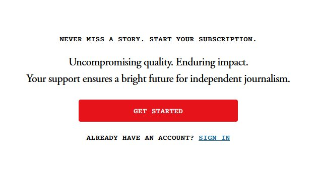
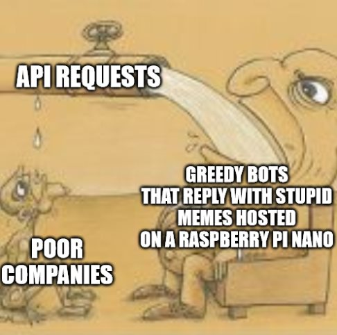

Note that even though I tried my best to find credible sources, this topic is quite subjective. It's objectively impossible to quantify and analyze the full extent of this problem.

In 2017 the American Library of Congress decided that it will no longer archive Twitter citing the sheer amount of data that flows through it as too much to handle.[^1] While this itself already sounds bad, it disregards another important problem far greater than the stopping of the archival process, it never collected any images, videos or anything else but text. [^2]

Images and videos, compared to text, are far more complicated to store long-term. In the past there have been many different sites that offered these services for free in the current environment of the “free” internet. The most recent case of a company admitting defeat to the long-term storage problem has been Imgur, which will be deleting NSFW and anonymous images on May 15th[^3]. Which affects an enormous pile of the internets images ever since the service exploded in popularity around 2012.

### Any company offering long-term *free* storage is doomed to fail

The fact is that mass-deletions are becoming more and more common as companies strive to reduce storage costs with even the largest players such as Google now announcing that they will be deleting accounts that haven’t been used within 2 years, even going as far as the deletion of Youtube videos, though they later backtracked on that statement after enormous backlash and noted it as a miscommunication[^4]

While there are great efforts to archive a lot of stuff, these efforts can only capture literal drops of a waterfall of data. A study from 2008[^5], even if it should be taken with a grain of salt given the immense changes in the internet landscape since then, found out that ~8% of all links died after one year and a staggering ~30% after three years.

### The Paywall

More and more online journals are hidden behind paywalls to sustain themselves, which in itself is fine, however, that also means that it’s becoming harder and harder to find information’s that were once public, including one of the references I wanted to use: [By the Atlantic]( https://www.theatlantic.com/technology/archive/2015/10/raiders-of-the-lost-web/409210/) which would cost me around 80€+ to view.

Similar goes for content hidden behind Paywalls such as Patreon, Fanbox or other sites that help independent artists fund their passion. While this isn’t an argument against them, the simple fact of the matter is that the amount of content that will be lost is unquantifiable.

### The Discord Walled Garden Problem

Discord is one of the worst things that has happened to the open internet. More and more niche hobbies are behind immense walled gardens, completely hidden from the free web and stuck on a platform with a complete monopoly of message history.

And it should be noted that Discord, recently even implementing forums[^6]  knows their absolute position of power over these communities. Suddenly it is impossible to get access to knowledge about subjects ranging from programming to gaming, which would have previously been discussed on “open” platforms such as Reddit (We’ll get to that later).

Aside from already hiding all this data which will one day perish together with discord, discord is also allowing communities to make it ever easier to increase the barriers to accessing all this information with features such as rules screening[^7]  that force new members to first go through a complete application form simply to get read access as in cases such as [QuiltMc](https://quiltmc.org/en/), which hides most of the discourse behind Discord[^8] (I swear that this isn’t a bad pun). 

### Building walls where there were none

A recent trend started by the openly transphobic[^12][^13] figure Elon Musk, known for sexual misconduct allegations[^14], after scrambling to somehow make his purchased social media platform Twitter, which since his purchase devalued to less than a third of the original purchase price in less than a year[^9], is to charge unreasonable prices to properly access its API. Charging $42.000 / Month for the most basic features. [^10]

The solidification and monopolization of access to data generated by it’s users was quickly followed by Reddit, which in the case of a popular client for the site recently became notable for wanting to charge more than $20.000.000 per year to access it’s previously free API. [^11]

While it is hard to make proper predictions for the future of the free web, the simple fact of the matter is that the internet has never been as private, walled and hidden as it is right now and continuous to do so. Every day we secretly might lose knowledge in comparison to the library of Alexandria without ever knowing that we do.

There are also other notable examples of this problem such as Game Streaming, Live Titles, Software As A Service, Always Online Software/Games but that is simply beyond what can be covered in 1000 words.

In the end this should only serve as a reminder that we can not and should not treat the internet like **The Internet doesn’t forget** because:

# The Internet does Forget

> See what I did there, wasn’t that a clever ending 😉

[^1]: 1 https://blogs.loc.gov/loc/files/2017/12/2017dec_twitter_white-paper.pdf
[^2]: 2 https://blogs.loc.gov/loc/files/2010/04/LOC-Twitter.pdf
[^3]: 3 https://help.imgur.com/hc/en-us/articles/14415587638029
[^4]: 4 https://blog.google/technology/safety-security/updating-our-inactive-account-policies/
[^5]: 5 http://worldcat.org/arcviewer/5/LEGAL/2011/06/15/H1308163631444/viewer/file73.pdf
[^6]: 6 https://support.discord.com/hc/en-us/articles/6208479917079-Forum-Channels-FAQ
[^7]: 7  https://support.discord.com/hc/en-us/articles/1500000466882-Rules-Screening-FAQ
[^8]: 8  https://modder.wiki.quiltmc.org/
[^9]: 9  https://www.businessinsider.com/twitter-elon-musk-fidelity-one-thrid-2023-5?op=1
[^10]: 10  https://www.wired.com/story/twitter-data-api-prices-out-nearly-everyone/
[^11]: 11  https://old.reddit.com/r/apolloapp/comments/13ws4w3/had_a_call_with_reddit_to_discuss_pricing_bad/
[^12]: 12 https://twitter.com/elonmusk/status/1664609193230204929?s=20
[^13]: 13 https://www.businessinsider.com/elon-musk-shares-anti-trans-content-twitter-2023-6?op=1
[^14]: 14 https://www.businessinsider.com/spacex-paid-250000-to-a-flight-attendant-who-accused-elon-musk-of-sexual-misconduct-2022-5