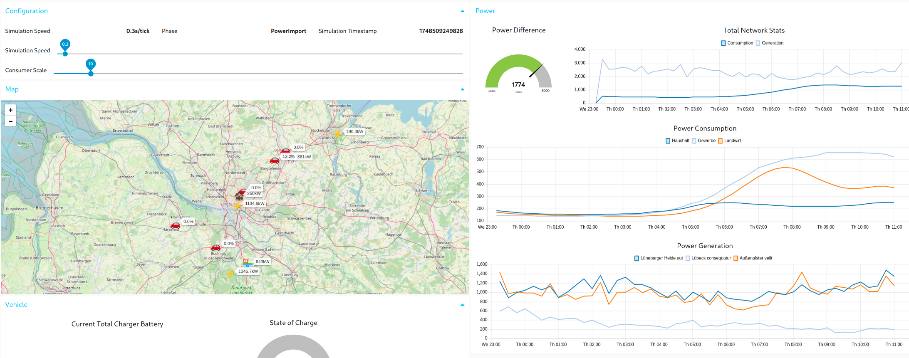

This is heavily inspired by [The Great Ramblers](https://tgrcode.com/posts/now_early_2024) idea of a "Now" section and its inspiration [NowNowNow.com](https://nownownow.com/about).

I am currently working on my Bachelor's thesis, which is a port of the Raspberry Pi Pico 2 to RIOT OS. 

It is definitely not easy but I have great help and am learning a lot about low-level programming and embedded systems.

I am also working on a cool uni project to simulate a power grid and electric vehicles. 

Completely different from what I would ever do in my free time but creating a cyber-physical system is quite interesting.
Also, naturally, written in Rust 🦀

For more projects you can visit my [Projects section](/projects).

---

I am also attending Japanese classes at the local Volkshochschule (adult education center) to learn the language.

I'm currently at the fourth course (A2.1) and do enjoy it a lot. It's quite the contrast to the rest of my life, which is mostly focused on programming and technology.

The struggle with learning a language comes from the daily routine of studying which is definitely not my strong suit.

However, thanks to the fact that I am attending a physical course, I am forced to study if I don't want to disappoint my teacher and look into their saddened eyes, which is a great motivator :P

---

Aside from that I've mostly been playing Dead By Daylight, Splatoon 3 and soon Mario Kart Worlds. 

I've also been thinking about replaying Breath of the Wild without fast traveling, 
feels like that could heavily improve the experience which combos with the Switch 2 upgrade. 

I've only ever played the game on v1.0 on the Wii U which is now more than 8 years ago (Damn).

But yeah that's about it, it is the _calm before the storm_ if you will, chillin' 🐸