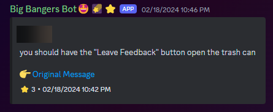

This Discord starboard bot is designed to support large servers with multiple channels of varying activity levels. 

It provides users with the ability to prioritize specific channels for starboard posting while ignoring others. 

Built with efficiency in mind.

➡️ Channel Prioritization: Specify which channels to prioritize when scanning.

➡️ Channel Ignoring: Choose which channels to ignore.

➡️ Efficient Resource Usage: Consuming less than 12MB of RAM for a discord server with 30 channels and 1.7 million messages

