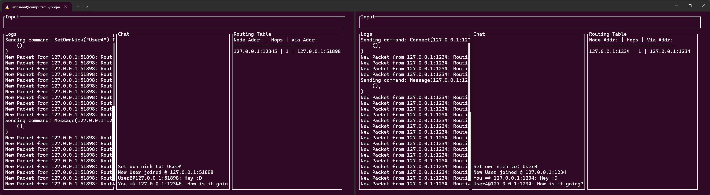

Morganite is a chat client for a pseudo chat protocol that was designed IETF-style with ~15 people.

The protocol works in a serverless manner while also only having a direct connection to some of the clients, which requires routing using Distance Vector with Poise Reverse & Split Horizon to mitigate routing loops.

