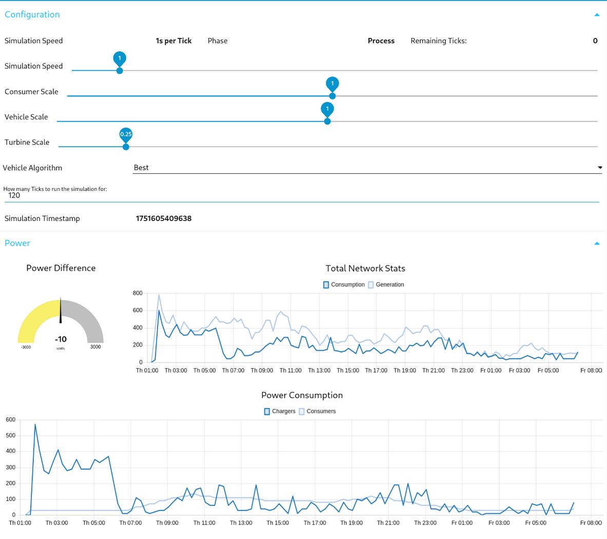

A cyberphysical power grid simulation that simulates a fully wind powered electrical grid including demand by electric vehicles. Fully written in Rust.

Including advanced features such as real world mapping, car types, driver behaviours, day and night cycle and so on.

