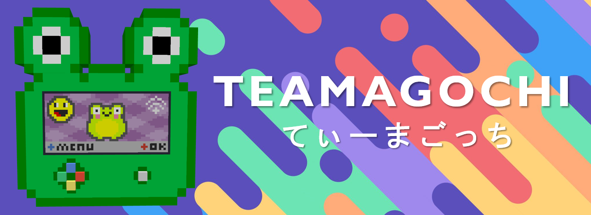

Teamagochi is a synchronized always-online pet simulator with multiplayer functionality​ by the RIOT Project SoSe24 team.

It consists of a physical device (Node), web backend and web/mobile frontend.

Made by a team of over 18 students.

 