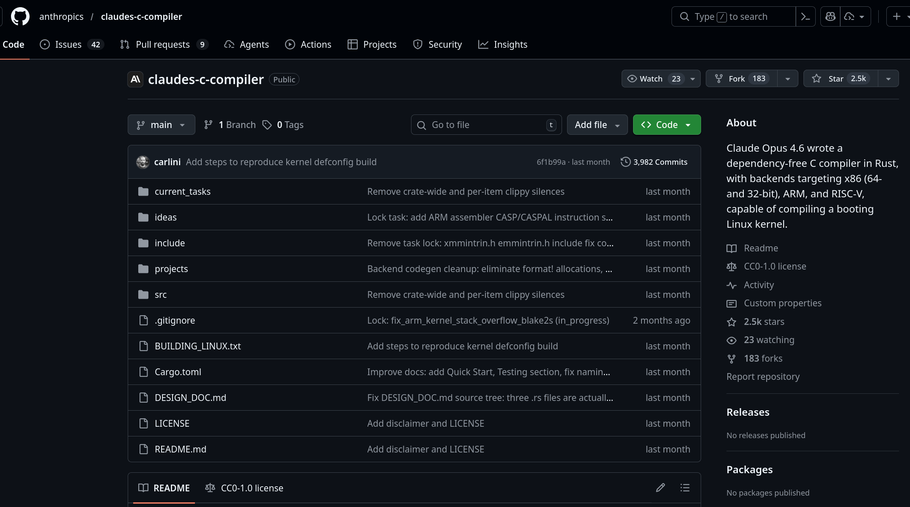
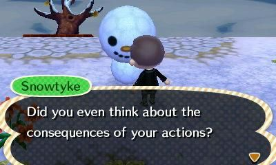

import Youtube from '../../components/Youtube.astro';

import problem_vid from "./images/is_ai_supposed_to_replace_me/problem.mp4"

__Rambling ahead__: This is a __rambling__ post, this means that I __ramble__ about a topic,
I do not have a clear structure in mind
and I do not really care about the flow of the post.
This isn't like that one proper
"The Internet Does Forget" post.

Recently my feed, esp. on Bluesky, has been flooded with posts about how
AI is either the pinnacle of human achievement and the end of the world as we know it
or utter garbage that will never be able to do anything useful.
As usual, the answer probably lies somewhere in the middle when it comes to programming,
but I do want to share my thoughts on the topic,
as I have been thinking about it a lot recently.

## Art, music and writing

Other fields such as art, music and writing have been heavily impacted by AI
and given the human soul and creativity that make those fields so special,
I'd go as far as to say that AI has been an undebatable net negative for those fields.

I do not want AI drawings, AI music or AI writing, even when AI has become so
good that the previously very obvious AI generated content is now indistinguishable
from human generated content, art is as much about the artist's journey
as it is about the final product.

<Youtube id="zhl-Cs1-sG4" title="Daft Punk - Giorgio by Moroder (Official Audio)" />

I do not want to listen to slop,
I want to be inspired by the works of the artists that I admire,
I want to see their style evolve and grow with time,
I want to see the human touch in their works.

AI directly devalues as soon as you realize it is AI because it becomes soulless,
it's slop that is generated by an algorithm that does not care about the final product,
AI does not have the capacity to care about the final product, it simply doesn't have
the concept of creativity and I've seen way too many people fall into a weird
AI psychosis where they think that AI does have feelings, [only to be disappointed when
their AI completely breaks when it hits the context limit](https://donotsta.re/notice/B3geqMzY6H54i8kZl2).

## Programming is different

Compared to this, programming is a more technical field
and while creativity, style and the programmer's history do play a role in programming,
it does involve a lot of boilerplate and repetitive work from time to time, which
is definitely what AI can do best.

### Vinext

Tasks such as reimplementing NextJS in Vite as Cloudflare has done with [vinext](https://github.com/cloudflare/vinext)
appear to showcase the power of AI to do the boring and repetitive work,
it did not have to deal with the design decisions, it simply had to plug the existing
NextJS API into Vite and make it work with a strong test suite
to make sure it worked as expected.
The claimed speedup does sound impressive, until you realize that the actual reason for
the speedup comes from the great engineering work that went into Vite and its ecosystem,
which made it so that the AI did not have to deal with any of the hard parts of the project.

Naturally, it also created some massive bugs, as Vercel / NextJS themselves have
reported to Cloudflare [^0]. Though it can be argued that massive security bugs are 
part of NextJS's legacy anyways ;P

### Anthropic's C compiler 

A more realistic view of AI is the experiment of Anthropic
with 16 AI agents working together to create a new C compiler [^1].
Once again sounds impressive until you realize that compilers are some of the
most defined and well documented software projects out there,
most likely appearing hundreds if not thousands of times in the dataset the AI was training on.

And also, the fact that it really really sucked at it,
the final compiler does not include its own linker and assembler and
is less efficient than the non-optimized output of gcc,
which is not exactly a glowing review of the capabilities of AI in programming
as they even state themselves [^2].

And, just to reiterate, creating a compiler is the perfect test for AI,
it is very well defined, has a lot of existing implementations
and there are very clear metrics to evaluate the success of the project through
the existing and rigorous test suites that exist for compilers.

## Imagine a world where AI will improve even more

We have arguably hit a bit of a plateau with AI (when it comes to text output),
the current models are not really improving that much in terms of capabilities,
esp. compared to the rapid improvements of the past,
most improvements are in usability and _vibe_ if you will.

However, for the sake of the argument, let's imagine a world where AI will improve to
the point where it is able to flawlessly generate code that is as good as or better
than human (experienced) programmers, and is able to do so in a reasonable time frame.

Even in this world, I do not think that AI will replace programmers.
My job is not actually to write code, actually, I'd argue that writing code
is the least important part of my job.

Throughout my degree and also my work experience with each passing semester
design, communication, and reviewing have become more and more important,
to the point where I would say that I might have been slowly regressing
in my actual coding skills. When I did the Advent of Code 2025,
I sometimes felt like I was struggling more to remember boilerplate and syntax
than to actually solve the problems itself.

If we imagine a world where AI can do the boilerplate and syntax for us,
then ... I mean, not a lot changes for me.

### Vibecoding

My position feels a bit privileged in this aspect though,
I feel like most of my coding skills were acquired *before* AI really was
a thing. I remember that in my last few semesters of my bachelor's degree,
it started being a given that around 80% of the students would vibecode their
assignments with AI. 

Something often neglected with the whole "AI will replace programmers" narrative is that
programmers actually need to understand what the heck they are doing.
In my own personal experience this is not really the case for a lot of first year students,
which actively worsens their learning experience and makes it so that they do not actually
learn the fundamentals of programming.

I, myself, have even slowly realized that AI assistance has worsened my learning
experience, as I have been relying on it more and more for the boilerplate and syntax,
which has made it so that I have been forgetting more and more of the syntax and boilerplate
and thus relying on it even more, which is a vicious cycle that I do not want to be in.

<video src={problem_vid} loop autoplay muted alt="Animal Crossing Quote: Admitting problem is first step" />

It's weird to cite Anthropic once again but I do have to admit that they
do a lot of good research on the impact of AI in general.
Of course it could be argued that they have a vested interest in making AI look good,
but I do think that their research on the impact of AI on coding skills is quite interesting [^3].

In it they show that while AI can be a great tool to get stuff done quickly,
it actively hindered the learning experience, or in their own words:

`Our results suggest that incorporating AI aggressively into the workplace, particularly with respect to software engineering, comes with trade-offs. The findings highlight that not all AI-reliance is the same: the way we interact with AI while trying to be efficient affects how much we learn. Given time constraints and organizational pressures, junior developers or other professionals may rely on AI to complete tasks as fast as possible at the cost of skill development—and notably the ability to debug issues when something goes wrong.` [^3]

### Final Thoughts

Overall, I don't think AI will replace programmers but I also don't think
AI will not help programmers. My long term prediction is that it's simply going to
be like IDE autocomplete on steroids,
it will be a great tool to get stuff done quickly,
but it will not replace the need for programmers
to understand what they are doing and to be able to debug issues
when something goes wrong.

Debugging is at the core of programming and it's a skill that is way too often
neglected in programming education. 

When print debugging works for 90% of the cases,
most people tend to rely on it and refuse to learn GDB or other proper debugging tools.

When AI can solve 90% of the problems,
most people tend to rely on it and refuse to learn how to program or other proper programming skills.

Maybe we should simply start using our brain :) 
Over the last few months, I've been reevaluating my relationship with AI coding assistance
and my new goal is to never use it in a context that has any educational value.

Fearing AI coding assistance does not make much sense,
AI coding assistance is probably the one field where AI has a really solid
use case but overreliance on it without the proper understanding will
hinder the learning experience, and thus hinder the development of programming skills,
which is essentially an infinite loop of worsening skills.

[^0]: https://nitter.net/rauchg/status/2026864132423823499#m
[^1]: https://arstechnica.com/ai/2026/02/sixteen-claude-ai-agents-working-together-created-a-new-c-compiler/
[^2]: https://www.anthropic.com/engineering/building-c-compiler
[^3]: https://www.anthropic.com/research/AI-assistance-coding-skills