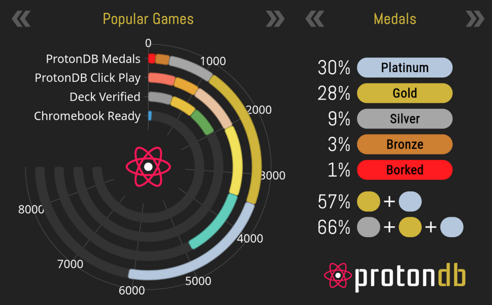

This was intended to be a proper blog post but I lost motivation to finish it and instead of letting it rot in my drafts I decided to publish it as a rambling.

## The Catalyst

A few months ago I tried setting up a massive docker swarm for [a cool project of mine](https://github.com/AnnsAnns/DistributedDiningPhilosophers) that is a massive distributed system. 
Since my main computer was running Windows 11 that meant dealing with the absolutely abhorrent Docker Desktop for Windows.
It once used to be even worse but the introduction of WSL2 has massively increased the usability of Docker (or rather, using Linux for Development on Windows).
Yet again Docker managed to completely freeze my rather high end computer, completely consuming my RAM and CPU, while running fine on my cheap 8GB 2 core laptop. 

After ranting about it to friends it seemed like I was not the only one experiencing difficulties with docker, and the internet confirmed [that theory](https://duckduckgo.com/?q=docker%20windows%20awful&ia=web).

One issue from *2023* (It is 2025 as of writing this) confirmed that my exact issue was extremely common even when having [64GB of RAM](https://github.com/docker/for-mac/issues/6987#issuecomment-2657782156).

Another issue I have had with Windows, esp. Windows 11 is the massive *enshittification*. 
Windows has decided to switch their main revenue stream from license sells to what I can presume as data analytics and ads, 
aside from the absolutely garbage AI that it continued to integrate with each update.

It feels my Windows 11 activity has become the product for Microsoft, not actually providing me a stable OS.

## The Origin

For the past years I was actually an avid WSL user, it felt like it gave me all I needed while still allowing me to play any games or use any software I wanted.

I have nearly always used Linux for my laptops because quite frankly, for me a laptop is something I use once a month for minor web browsing or notes and as such
I was not stuck in the hellhole of Windows-only software.

I also played around with Linux as my main operating system in the past, on my very first laptop when I was 10 years old I was actually forced to exclusively use Linux as
it had a really faulty RAM which completely broke Windows support. 

I booted up a Linux Mint ISO from a computer magazine I bought at the local gas station that continued being my main OS for a few years till I was finally able to buy a proper gaming computer which also meant I could finally end my Linux journey.

Aside from that I have had the bi-yearly "Lets try Linux" phase only to switch back to Windows after a few weeks and leave the corpse of my dual boot setup behind.

As a main OS Linux was alright, great for normal web browsing, awesome for programming, however it had one massive flaw that was always the final straw for me.

## Gaming on Linux

Look, I enjoy playing games, I have accumulated thousands of hours across different games. I would be frightened to ever even know how much I have played Minecraft.

But as somebody that had to use Linux as a 10 year old one thing was quite obvious ... the Gaming experience was beyond awful.

There will always be people defending Gaming on Linux but the reality was that aside from Valve and a few indie games you were absolutely left behind.

Valve tried making Linux viable, even investing a lot into so called Steam Machines, small Mini-PCs that acted as video game consoles running their own SteamOS
but ultimately it failed to garner enough interest, esp. since most modern games absolutely ignored their push.

Thus considering my limited hardware at the time Minecraft was the only viable game. 
Later as I grew older I also started playing Team Fortress 2 with a staggering 15FPS on the very lowest settings possible. 
(To this day I wonder how I managed to do that without going insane).

That was about it though, even years later it were only games like Payday 2, Team Fortress 2 and Minecraft that even worked on Linux.

## Steam Deck and Proton

While the aforementioned Steam Machines absolutely failed Valve kept improving [Proton](https://github.com/ValveSoftware/Proton)
a wrapper around Wine that specialized on the gaming experience and made it possible to play Windows games on Linux. 
With each passing year it continued improving to the point that nearly everything that did not have an Anti Cheat worked quite well.

Around this time Valve decided to launch the Steam Deck, a small Switch-like handheld using a modern Arch Linux (I use Arch btw) + KDE Plasma (I use KDE b....) based SteamOS distro.
While still not at the size of other game consoles the combination of extremely tight profit margins, well integrated software and the fair more lightweight OS that is Linux
managed to make it stand out and arguably kickstart an entire new industry of Desktop handhelds.

This was also the moment when a lot of game developers took serious efforts to adapt to this change in the market and allow Linux users to play their games.

Some such as Hello Games, the creators of No Man's Sky, by fixing bugs that only affected Linux/Proton users but often even letting Linux gamers pass their anti cheat systems.

Which meant that suddenly Linux was not just passable for gaming, it became absolutely viable to use it.

## I use Arch btw

So coming back to my anger with Docker and Windows 11, this was my breaking point, I could not deal with this absolute crap anymore.
I expected to make some sacrifices but ultimately concluded it to be worth it and installed Linux under a dual boot setup.

I gave it a separate SSD with the idea of using it as my "programming and youtube" OS while using Windows for all the proprietary software that I would be forced to use.

The reality was different though, compared to the previous attempts where I slowly stopped using Linux over time, it felt dreadful to boot Windows again and with
each passing week Windows slowly started becoming more and more of a corpse, after a few months I even decided to wipe my larger storage HDD and reformat it to be used for more Linux data.

As of writing this I have not even launched Windows a single time for nearly two months.

There are still some caveats of course, Fortnite being a big one, as it is still something I enjoy with friends from time to time.
The Xbox Gamepass also naturally does not work on Linux which meant that I had to buy games such as Sea of Thieves on Steam, which, as usual worked absolutely flawlessly.

A decade ago the question for me was "What works on Linux", nowadays I would rather ask myself "What does not work on Linux".

I buy and play games without ever even thinking about whether they might not run, as a small insight, here are some of the games I have played recently:

| Game | Anti Cheat | Experience |
|------|------------|------------|
| [Dead By Daylight](https://www.protondb.com/app/381210) | EasyAntiCheat | Flawless, I have less issues than friends on Windows |
| [Satisfactory](https://www.protondb.com/app/526870) | None | Identical to Windows |
| [Foundation](https://www.protondb.com/app/690830) | None | Flawless (On Release) |
| [Sea of Thieves](https://www.protondb.com/app/1172620) | EasyAntiCheat | Better than Windows |
| [Overwatch 2](https://www.protondb.com/app/2357570) | Own Anticheat | Nearly perfect |
| [Rift of the NecroDancer](https://www.protondb.com/app/2073250) | None | Flawless (On Release) |
| [R.E.P.O.](https://www.protondb.com/app/3241660) | None | Flawless (On Release) |
| [Abiotic Factor](https://www.protondb.com/app/427410) | None? | Better than Windows |
| Team Fortress 2 | VAC | Native |
| Minecraft | None | Native |

It is hard for me to find any reasons to not recommend Linux at this point, there is no category in which Windows has felt like a better experience in my day to day.