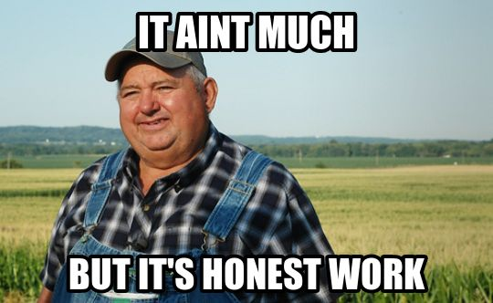
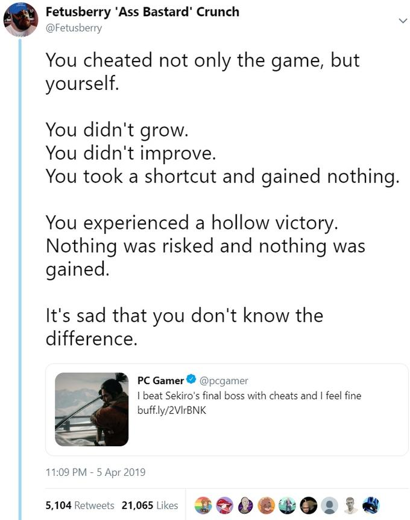

import Youtube from '../../components/Youtube.astro';

__Rambling ahead__: This is a __rambling__ post, this means that I __ramble__ about a topic,
I do not have a clear structure in mind
and I do not really care about the flow of the post.

I think last time I ranted enough about
my personal views about AI in [Is AI supposed to replace me?](/ramblings/is_ai_supposed_to_replace_me/).
I honestly don't even want to weigh any merits of AI, you can say that AI will save 
your life, AGI is around the corner or whatever but the real problem is that
AI is a really freaking annoying part of my life and I don't want to deal with it.

## The thankless job

Open Source software is cool, I think everyone can agree on that,
it powers your computer, coffee machine and probably even your toothbrush.
Software would not exist without the free or badly paid labour of open source maintainers.

Time and time again we have seen how open source projects are treated like garbage with
no funding from the companies that use them, and how maintainers are expected to 
do all the work for free.

Most open source software stays either a single maintainer project, gets abandoned or
thanks to various factors gets a smaller team of maintainers charged with keeping it functional
and adding new features, fixing bugs and so on.

Given that, every open source maintainer highly appreciates every single
contribution by outside contributors, even the stupid whitespace fixes,
because they are a sign that someone is actually using the software and cares about it.

Sometimes I work on stuff and I have no idea if anyone is using it,
heck I sometimes wonder whether anyone uses the software at all,
and then you get a random pull request from a guy working for a company in the industry
suddenly adding a new feature that requires a lot of work and testing,
and you are like "oh, someone is actually using this, that's nice".

## Getting people accustomed to a project

Working on a codebase that you did not create yourself is like cooking in the kitchen
of a friend. You have no idea where the utensils are but your cooking skills 
aren't really affected by that, it just takes a bit of time to get used to the new environment.

When you are a maintainer of an open source project, you are basically the owner of the kitchen,
you know where everything roughly is and you know how to use it.
Training people to use your kitchen is a bit of a pain,
you have to explain where everything is and how to use it,
nonetheless, you are happy to do it because it means
that someone is actually using your kitchen and wants to cook there.

The same applies to open source software, the first PR is always the hardest,
the second one is a bit easier and by the Nth one you probably started organizing the
utensils for other people to use.

Projects often go out of their way to leave easy issues for new contributors,
not because they couldn't do it themselves but because getting people do to their
first contribution is such a hard and important step that they want to make it as easy as possible.

## The endless backlog

Congrats, your project has become popular, you have a lot of users and contributors!
So many in fact, that you have more pull requests than your team of maintainers can handle,
and more issues than you can keep track of. You are doing your best to keep up with the demand,
but at the end of the day you are happy when you can keep a stable level
of open pull requests and issues, even if it means that some of them will be open for a while.

Some of them will take hundreds of hours of work to review,
some of them will be a simple one line change.
It's a mixed bag but you know that the other side has put in the effort to make the change
and every PR deserves the same respect from you it shows that they care about the project
and want it to be better, even if they are just fixing a typo.

Sure, sometimes you get a PR that is just a mess, but you still have to review it,
every person learns over time, my first PRs sure weren't the best
but I still got them reviewed and merged,
and I am sure that the person on the other side of the PR is just as new as I was back then.

Reviewing a PR is not just about the code, it's about the person behind it.

## The AI middle finger

<Youtube id="ifaoKZfQpdA" title="Oh Brother, this guy stinks!" />

`Claude, please add this feature to the project` is worse than a whitespace fix,
when a PR description feels like something no human would ever write,
sometimes not even respecting the formatting guidelines of the project,
you know that the PR was generated by an AI, and you are just left there wondering
what the point of it is, why did the person even bother to generate a PR like this
and what they expect you to do with it.

Why do I have to review a PR that was generated by an AI? Why do I have to deal with this?
When the other side does not give a shit to do the bare minimum, why should I, there are
400 other PRs waiting for my attention.

### The Idiot Test

In a project I work a lot on, we recently, after a longer debate, added a declaration of AI usage
in PRs.
The problem is, it's hard to distinguish between genuine contributions
and AI-generated ones. AI-usage is a spectrum, it can range from inline assist that just
finishes my function call to full on autonomous agents.

Yet, in nearly all cases where AI usage is more than inline assist,
it feels extremely obvious and in nearly
no cases do they ever declare it. Sometimes it's something simple,
like documentation being generated by AI but sometimes you notice things so insane
that no sane human would ever write them like this and you are left wondering,
does the person on the other side actually do any thinking anymore or do they
just leave it to a computer to decide.

And even more, what is your goal of not declaring AI usage, clearly you want to hide it,
but why? Why do you want to hide it?

Do you think that AI usage is something to be ashamed of?

Do you think that AI usage is something that should be hidden from the maintainers of the project?

Do you think that AI usage is something that should be hidden from the users of the project?

Do you think that AI usage is something that should be hidden from the world?

Why do you expect me to deal with this?
Wasn't the entire idea of AI that it would be a tool to help us
and not a tool that moves the entire burden of work to the maintainers of the project?

### Enabling the lazy

<Youtube id="iZlpsneDGBQ" title="WHEN WILL YOU LEARN THAT YOUR ACTIONS HAVE CONSEQUENCES?" />

The problem with AI is that it enables laziness to a degree
that is unprecedented in the history of software development.
it allows people to not put in the effort to learn and grow as developers.

In academia, we have seen how AI has been used to write entire papers,
and how students pass assignments without actually doing any work,
completely skipping the learning process.
See my previous post [Is AI supposed to replace me?](/ramblings/is_ai_supposed_to_replace_me/) for more on this.

AI can be a good tool, but when I really think about it from the perspective of a maintainer,
it's a net negative, the amount of work it creates versus the times it has
actually usually been useful is just not worth it.

When projects close themselves off to AI generated contributions,
they are not trying to be elitist, or simply protecting themselves from the
uncertain legal implications of AI generated code,
they are protecting themselves from the sheer amount of thankless work
that AI generated contributions create for maintainers.

Open Source is a contract between infinite theoretical users
and a finite number of maintainers, when you add AI generated contributions to the mix,
the bucket of work that maintainers have to deal with becomes infinitely larger,
and it's just not sustainable.

## Why do I need you to prompt for me?

Lets imagine that AI contributions weren't mostly garbage,
models have improved so much that even the most idiotic person can generate
a PR that is actually useful and does not require a lot of work to review.

Where does the contributor fit in this picture? What is their role? What is their value add?
Why can't I just ask the AI to generate the PR for me
and then I can just review it and merge it if it's good enough?

Clearly the contribution standards of the project provide value to you,
otherwise, why not just ask the AI to recreate the project for you,
and then you can just review the generated code and merge it if it's good enough?

If AI was good, you would be useless to me as a maintainer, so clearly it is not.

### Conclusion

<Youtube id="IyMJ4FhYiEw" title="I Don't Want to be an Engineer (cover)" />

I am most definitely not the first to ramble about this, there are countless posts and discussions
from more respectable maintainers from projects such as Zig and so on.

All this is to say,
please stop sending me AI generated PRs,
I don't want to deal with them,
they are a waste of my time and they do not add any value to the project,
if you want to contribute, put in the effort to learn and grow as a developer,
and then contribute something that you are proud of,
not something that you just generated with a few clicks
and try to pass it off as your own work.

You are lame if you do that, and I don't want to deal with you.